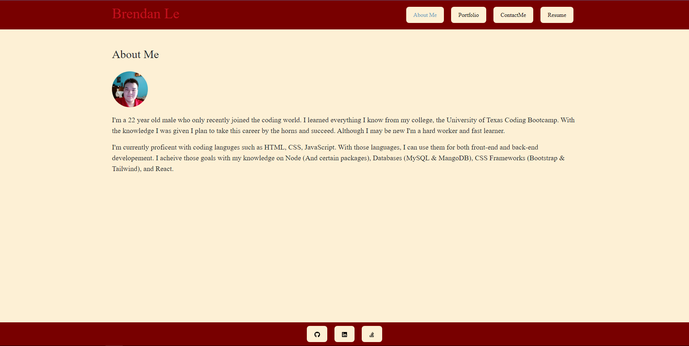

# React-Portfolio

This Front-end webpage uses react and vite inorder to create my personal portfolio.

## Description

This react based project was a basis on tapping into the knowledge of react based programming. Through this experience i was able to proberly get an understanding of its inner workings. I had little to no problems along, the way other than formating issues and implemenation of certain elements. In the end though i was able to create a sleek website that properly conveys who I am, and how I am as a developer.

## Installation

[Repository](https://github.com/B-R-Ls/Profile-Manager)

[Deployed Webpage](https://main--teal-lebkuchen-7745ec.netlify.app/)

## Usage

This portfolio can be used to browse information on me the developer, and travel through webpages to see skills, see previous works, contact me, and read my resume.

## Credits

[React](https://react.dev/)

[Vite](https://vitejs.dev/)

## License

